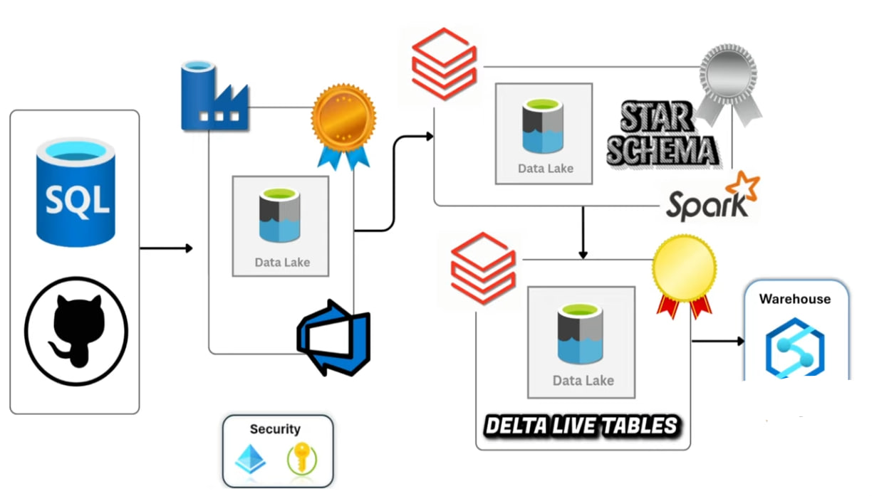
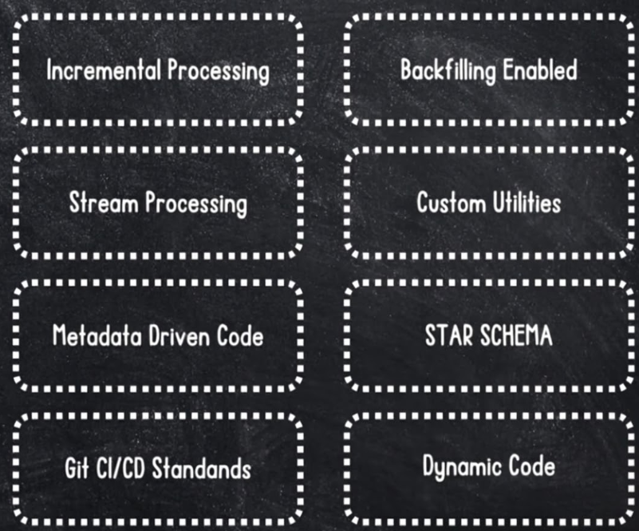
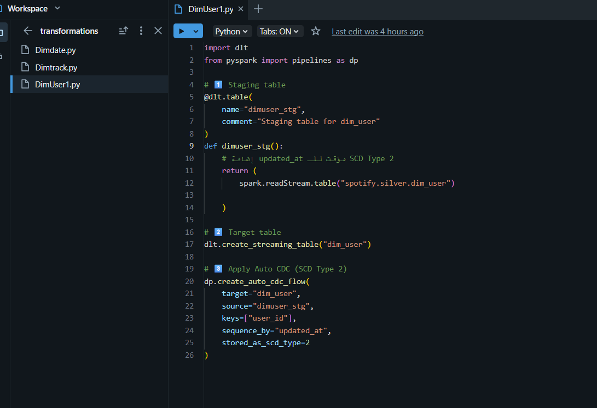
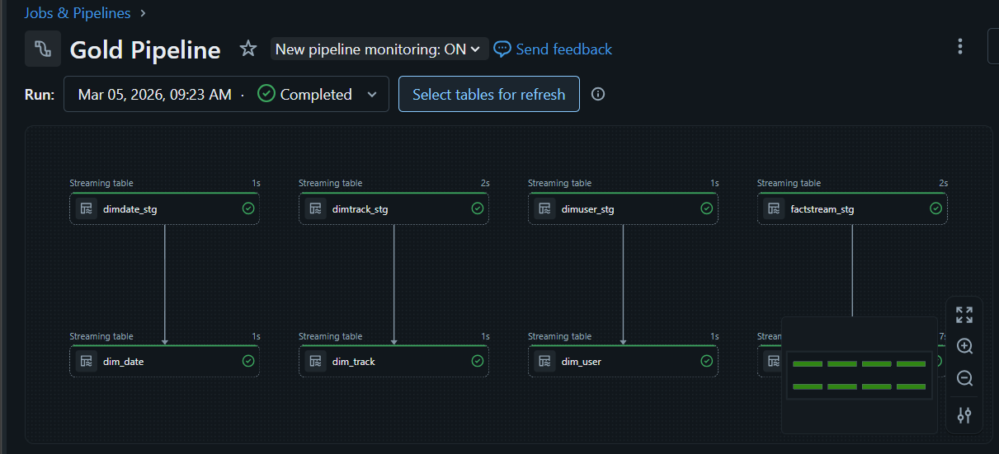
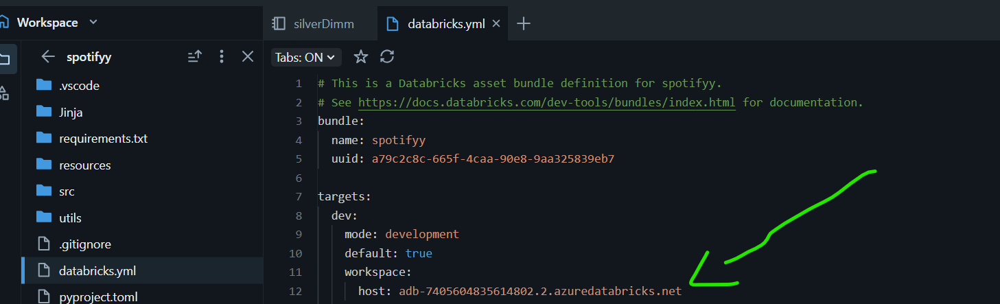
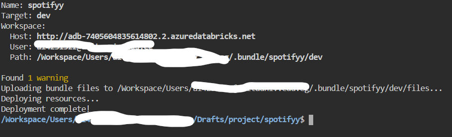
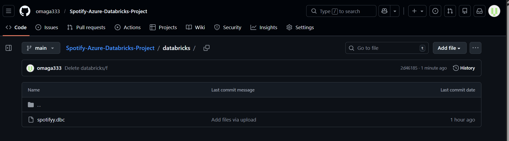

# Spotify-Azure-Databricks-Project

 The goal is to build a full-fledged **data engineering pipeline** with modern industry practices, including incremental processing, backfilling, streaming data, and metadata-driven pipelines.
---

## Project Architecture



The project follows the **Medallion Architecture** (Bronze → Silver → Gold) with the following flow:

1. **Source**

   * Primary source: **Azure SQL Database** (cloud-hosted)
   * Secondary source (optional): **GitHub repository** for static files
   * Purpose: Provide raw data for the pipeline

2. **Bronze Layer**

   * Tool: **Azure Data Factory**
   * Function: Load raw data into the Bronze layer
   * Features:

     * Incremental data load
     * Parameterized and dynamic pipelines
     * Git integration for CI/CD
   * Significance: Data remains raw, ready for processing in Silver layer

3. **Silver Layer**

   * Tool: **Azure Databricks**
   * Function: Process and enrich data
   * Features:

     * Learn and use the latest Databricks frameworks
     * Spark Structured Streaming and AutoLoader
     * Unity Catalog, metastore, credentials, external locations
     * Metadata-driven notebooks and pipelines
     * Star schema modeling and slowly changing dimensions
   * Significance: Transforms raw data into structured and enriched data

4. **Gold Layer**

   * Tool: **Delta Live Tables (Azure Databricks)**
   * Function: Build final curated models
   * Features:

     * CI/CD using Databricks Asset Bundles
     * Ready for dashboards or sharing endpoints with other teams
   * Significance: Provides clean, production-ready data

---

## Key Concepts Covered


* **Incremental Processing:** Process data in small increments rather than bulk
* **Backfilling:** Fill missing data for specific intervals
* **Streaming Data:** Real-time data processing using Spark Structured Streaming
* **Custom Utilities:** Python classes and functions reusable across pipelines
* **Metadata-Driven Pipelines:** Build dynamic pipelines controlled by metadata
* **Star Schema & Slowly Changing Dimensions:** Standard dimensional modeling in data warehousing
* **Git & CI/CD Integration:** Collaborate efficiently and deploy pipelines reliably
---


This project demonstrates **Incremental & Backfill Data Pipelines** using **Azure SQL Database** as the source and **Azure Data Lake Storage Gen2** as the sink.
The pipelines are built with **Azure Data Factory (ADF)** and implement **dynamic, parameterized queries** to handle multiple tables efficiently.

---

## Features

* ✅ Initial Load & Incremental Load in the same pipeline
* ✅ Backfill (Backdated refresh) for historical data
* ✅ Parameterized pipeline for any table and schema
* ✅ JSON file to store the last loaded value (CDC) for incremental loads
* ✅ Scalable to handle large datasets without full reload

**Components:**

1. **Link Services:** Connect SQL DB & Data Lake to ADF
2. **Datasets:** Dynamically select table, schema, and CDC column
3. **Pipeline:** Copy activity with dynamic query and JSON tracking
4. **JSON:** Stores last CDC timestamp for incremental loading

---

## Setup Instructions

### 1️⃣ Azure SQL Database

* Deploy your SQL DB
* Run the provided SQL scripts to create tables and insert pseudo data:
;

### 2️⃣ Azure Data Lake Gen2

* Create storage account
* Generate an **account key** for authentication

### 3️⃣ Azure Data Factory

* Create **Link Services**:

  * SQL DB: SQL Authentication
  * Data Lake: Account Key
* Create **Datasets** with parameters:

  * `schema`
  * `table`
  * `cdc_column`

### 4️⃣ Pipeline

* Use **Copy Activity**:

  * Source: SQL Database (dynamic query)
  * Sink: Data Lake
  * Parameters for table, schema, and CDC column
* Use **JSON file** to store last CDC value:

```json
{
  "CDC": "1900-01-01"
}
```

* SQL Query with parameters:

```sql
SELECT *
FROM @{pipeline().parameters.schema}.@{pipeline().parameters.table}
WHERE @{pipeline().parameters.cdc_column} > '@{activity('GetLastCDC').output.lastCDC}'
```

تمام يا هيثم، هعمللك **ملف README** مرتب يشرح كل اللي اتكلمنا عنه في الفيديوهات عن **Backfilling و Looping Pipelines في ADF**، بحيث تقدّر تستخدمه كمرجع لأي مشروع Data Engineering:

---

# R Backfilling & Looping Pipelines in Azure Data Factory (ADF)


* **Initial Load** – load all historical data.
* **Incremental Load** – load only new/updated records using CDC (Change Data Capture).
* **Backfilling / Backdated Refresh** – load historical data from a specific date if needed.
* **Looping / Multi-table Processing** – run the same logic for multiple tables dynamically.

The goal is **efficient, optimized ingestion** with minimal resource usage.

---

## 1️⃣ Parameters

### Pipeline Parameter


* **Empty:** Pipeline will run normally with incremental load using last CDC value.
* **Set:** Pipeline will backfill data starting from the specified date.

### Example in Copy Activity Query

```sql
WHERE updated_at > 
@if(empty(pipeline().parameters.from_date), activity('GetLastCDC').output.value, pipeline().parameters.from_date)
```

**Explanation:**

* `empty()` checks if the `from_date` parameter is provided.
* If empty → uses last CDC (incremental load).
* If not empty → uses provided backfill date.

---

## 2️⃣ Handling Empty Files

* A **Delete Activity** is used to remove empty files generated during pipeline execution.
* Ensures storage is clean and no useless files remain.

---

## 3️⃣ Backfilling Example

* Backfill from **2022-01-01**:

```text
from_date = "2022-01-01"
```

* Pipeline reads historical data, loads it, and updates CDC tracking dynamically.

---

## 4️⃣ Looping Multiple Tables

Instead of manually running pipelines for each table:

### Steps:

1. Create a **ForEach activity** in ADF.
2. Prepare a **JSON array of table metadata**:

```json
[
  {"schema": "dbo", "table": "dim_user", "cdc_column": "updated_at", "from_date": ""},
  {"schema": "dbo", "table": "dim_track", "cdc_column": "updated_at", "from_date": ""},
  {"schema": "dbo", "table": "dim_artist", "cdc_column": "updated_at", "from_date": ""},
  {"schema": "dbo", "table": "dim_date", "cdc_column": "updated_at", "from_date": ""}
]
```

3. Feed this array into **ForEach activity** → loop iterates over all tables.
4. Inside loop → Copy Activity uses values from current iteration instead of pipeline parameters.

**Benefits:**

* Avoids creating multiple pipelines.
* Fully dynamic, scalable solution for multiple tables.

---

## 5️⃣ Folder & CDC Structure

* Each table has its own **CDC folder**:

```text
/table_name/cdc/
```

* Place files:

  * `cdc.json` → tracks last CDC timestamp.
  * `empty.json` → used for empty file handling.
* Initial load of `cdc.json` should have a default historical date, e.g., `1900-01-01`.

---
تمام يا هيثم، أنا هلخّصلك شرح **Spark Streaming مع Databricks Autoloader** ده بطريقة **منظمة خطوة بخطوة**، بحيث يبقى عندك README عملي أو ملاحظات مرجعية لأي مشروع:

---

# README: Spark Streaming with Databricks Autoloader


Autoloader in **Databricks** is a high-level streaming ingestion framework built on **Spark Structured Streaming** that simplifies incremental data loading from cloud storage (like ADLS, S3, or GCS).
N, Parquet, Delta, CSV, etc.

---

## 1️⃣ Autoloader Concept

1. **Source:** Your raw data storage (Data Lake / ADLS / S3).
2. **Autoloader:** Wraps Spark Structured Streaming to handle incremental load.
3. **Destination:** Silver / Gold layer (processed data).

**Flow:**

```text
Source --> Autoloader (streaming, checkpoint, schema evolution) --> Destination
```

* Reads data as **micro-batches**.
* Avoids re-processing already loaded files (**Exactly Once**).
* Maintains **checkpoint** for idempotency.

---

## 2️⃣ Schema Evolution

Autoloader can handle schema changes automatically:

| Mode                  | Description                                                                         |
| --------------------- | ----------------------------------------------------------------------------------- |
| `add_new_columns`     | Default. Adds new columns to the DataFrame.                                         |
| `rescue`              | Puts new/unexpected columns into a single `rescued_data` column as key-value pairs. |
| `fail_on_new_columns` | Fails the stream if new columns appear.                                             |
| `none`                | Ignores new columns.                                                                |

**Usage:**

```python
.option("cloudFiles.schemaEvolutionMode", "add_new_columns")  # or "rescue"
.option("cloudFiles.schemaLocation", "<path_to_schema_dir>")
```

---


* **`format("cloudFiles")`**: Tells Databricks to use Autoloader.
* **`schemaLocation`**: Directory where schema metadata is stored.
* **`load()`**: Reads all files incrementally.

---

## 4️⃣ Checkpointing

* Autoloader automatically stores metadata in **checkpoint folder**.
* Helps Spark know which files were already processed (**Exactly Once**).
* Directory structure:

```text
dim_user/
├── data/           # Streamed files
└── checkpoint/     # Autoloader tracking info
```

---

## 5️⃣ Transformations

* Can apply any Spark transformation **while streaming**:

```python
df_user = df_user.withColumn("username", upper(df_user.username))
```

* Useful for:

  * Standardizing text (uppercase/lowercase).
  * Dropping unnecessary columns (`drop("rescued_data")`).
  * Deduplication based on primary keys.

---

# Data Engineering Pipeline: Python Utilities & Silver Layer Process

6️⃣ Utilities


This is a solid foundation for a technical project. Below is a structured, professional **README.md** tailored for a GitHub repository. It focuses on the architectural flow and the "Silver Layer" engineering philosophy you described.

Instead of writing repetitive transformation logic in notebooks, this project centralizes core functions into a reusable Python class.

* **System Path Integration:** Ensures the project root is accessible by the Spark/Databricks runtime to import custom modules seamlessly.
* **The "Transformer" Class:** A dedicated class housing logic for common ETL tasks:
* **Schema Cleaning:** Dropping unnecessary columns (e.g., `rescue_data`).
* **Deduplication:** Ensuring item-level uniqueness across batches.
* **Dynamic Selection:** Using list unpacking (`*args`) to pass column arrays to Spark functions cleanly.


---

## 🔄 Silver Layer Workflow

The Silver Layer represents "cleansed" and "conformed" data. This pipeline follows a strict incremental processing pattern.

### 1. Incremental Ingestion

* **Autoloader:** Utilizes Spark Structured Streaming to detect and process new files arriving in the landing zone/Bronze layer without reprocessing old data.

### 2. Transformation Logic

* **Column Pruning:** Removing metadata or technical columns not required for downstream analysis.
* **Standardization:** Applying the reusable utility class to ensure consistent transformations across different data streams.
* **Idempotency:** Designing the process so that re-running a batch doesn't result in duplicate records or inconsistent states.

### 3. Data Persistence

* **Delta Lake Format:** Data is written in Delta format to provide **ACID compliance** and schema enforcement.
* **Checkpointing:** Maintains the state of the stream, allowing the pipeline to recover from failures exactly where it left off.
* **Table Optimization:** Saving as a managed/external table for high visibility in the data catalog and optimized query performance.

---

## 💡 Best Practices & Philosophy

* **Session Management:** Always restart the Python kernel/session if module paths are updated to avoid cached import errors.
* **Incremental Testing:** Validate transformations on micro-batches before committing to a full-scale write.
* **Resilient Engineering:** Focus on building robust code that anticipates "messy" upstream data. The goal is a resilient solution, not just a one-time fix.
* **Storage Agnostic:** While this implementation focuses on **Delta Lake** (standard for Azure/Databricks), the logic is adaptable to other lakehouse formats like Apache Iceberg or Hudi.

---
Based on your interest in **Metadata-Driven Pipelines** using **PySpark** and **Jinja2**, I've refined your GitHub README to reflect the advanced automation concepts discussed in the video. This approach transforms static SQL writing into a dynamic, scalable engine.

---

# 🚀 Metadata-Driven Data Engineering with Jinja2 & PySpark

This repository showcases a "next-level" engineering pattern: using **Jinja2 templating** to programmatically generate complex SQL queries for the Silver Layer. Instead of writing manual joins for every new business request, we build a **Dynamic SQL Engine**.

## 🧠 Why Metadata-Driven?

Data engineers often face repetitive requests from stakeholders for specific "Business Views" (e.g., combining `fact_stream` with `dim_user`). Writing these manually is:

* **Time-consuming:** Re-writing similar logic for different tables.
* **Error-prone:** High risk of typos in join conditions or column names.
* **Inflexible:** Hard to update many views at once if a schema changes.

**The Solution:** Use Python dictionaries as "Metadata" and Jinja2 as the "Template Engine" to auto-generate the SQL.

---

## 🛠️ The Technical Stack

* **PySpark:** For heavy-lift data processing.
* **Jinja2:** A powerful templating language (traditionally for web dev like Flask/Django) used here to inject logic into SQL strings.
* **Delta Lake:** The storage layer for ACID-compliant Silver tables.

---

## 🏗️ The Workflow

### 1. Define the Metadata (The "Input")

We define our requirements in a structured Python list of dictionaries. This controls which tables to join, which columns to select, and the join keys.

```python
parameters = [
    {
        "table": "spotify_catalog.silver.fact_stream",
        "alias": "fact_stream",
        "columns": ["stream_id", "listen_duration"]
    },
    {
        "table": "spotify_catalog.silver.dim_user",
        "alias": "dim_user",
        "columns": ["username"],
        "condition": "fact_stream.user_id = dim_user.user_id"
    }
]

```

### 2. The Jinja2 SQL Template

We create a skeleton SQL string with Jinja2 loops and conditionals. This template handles:

* **Dynamic Selection:** Looping through columns and adding commas (except for the last one).
* **Automated Joins:** Detecting the first table as the `FROM` clause and subsequent tables as `LEFT JOIN`.

### 3. Rendering and Execution

The Python script merges the **Metadata** with the **Template** to produce a clean SQL string that Spark can execute.

```python
from jinja2 import Template

sql_template = """
SELECT 
    
        {{ param.columns | join(', ') }}, 
    
FROM {{ parameters[0].table }} AS {{ parameters[0].alias }}

LEFT JOIN {{ param.table }} AS {{ param.alias }}
    ON {{ param.condition }}

"""

# Render and Run
final_sql = Template(sql_template).render(parameters=parameters)
df_business_view = spark.sql(final_sql)
```
---


## 🏆 Gold Layer: Star Schema & Data Historization (SCD)

In the final stage of the pipeline, data is transformed from the cleansed Silver Layer into a business-ready **Star Schema**. This layer is optimized for high-performance analytics, BI reporting, and historical data tracking.




### 🧩 Core Modeling Concepts

* **Star Schema Design:** Organizing data into central **Fact Tables** (quantitative events) and surrounding **Dimension Tables** (descriptive attributes) to simplify querying.
* **Slowly Changing Dimensions (SCD):**
* **SCD Type 1 (Overwrite):** Updates existing records directly. No history is kept. This is used for Fact tables or dimensions where history isn't critical.
* **SCD Type 2 (History Tracking):** Tracks every change by creating new rows with versioning (Start/End dates). This allows the business to "travel back in time" and see user or product attributes at any specific date.



### ⚙️ Declarative Workflow (Delta Live Tables)

The pipeline utilizes **Databricks Lakeflow (DLT)** to implement a declarative engineering approach. Instead of manual processing steps, we define the desired state of the data:

1. **Staging Phase:** Creating streaming views that capture incremental changes from the Silver Layer in real-time.
2. **Automated CDC (Change Data Capture):** Leveraging the `APPLY CHANGES` logic to automatically handle inserts, updates, and deletes without manual merge scripts.
3. **Data Sequencing:** Using sequence keys (e.g., `updated_at` timestamps) to resolve out-of-order data, ensuring the most recent information always prevails.

---

### ✅ Data Quality & Governance (Expectations)

To maintain the "Gold Standard" of data, integrated quality constraints—known as **Expectations**—act as a gatekeeper:

* **Validation Rules:** Ensuring critical fields (like IDs) are not null and maintain referential integrity.
* **Enforcement Policies:**
* **Warn:** Flags records that violate rules for monitoring without stopping the flow.
* **Drop:** Automatically discards non-compliant records to prevent downstream corruption.
* **Fail:** Halts the entire pipeline if critical data quality thresholds are not met.

---

## 🔄 Incremental Loading & End-to-End Testing

In a real-world production environment, you don't process your entire dataset every day. Instead, you perform **Incremental Loads**, where only new or changed data is processed.

### 1. The Challenge: Primary Key Constraints

To simulate a real-world update, we often need to insert data into a source (like Azure SQL) that might contain duplicate keys if the schema is strictly enforced.

* **The Process:** We drop existing primary key constraints on the source tables to allow "messy" or "duplicate" incremental data to flow into our pipeline. This tests the **Idempotency** of our Spark logic.

### 2. Validation of SCD Type 2

During incremental testing, we look for two specific outcomes in our **Gold Layer**:

* **New Records:** Fresh data points are inserted with `is_current = TRUE`.
* **Updated Records:** For existing users or tracks that changed, the old row is "expired" (`end_at` is set) and a new row is created.

### 3. Sequence-By Logic

The secret to reliable incremental loads is the `sequence_by` property in Delta Live Tables. This tells Spark which record is truly the "latest" based on a timestamp (e.g., `updated_at`), preventing older data from overwriting newer data if it arrives out of order.

---

## 📦 Databricks Asset Bundles (DABs) for CI/CD

Moving from a "Notebook" approach to an "Engineering" approach requires professional deployment. **Databricks Asset Bundles (DABs)** allow us to package our entire project—code, pipelines, and configurations—as a single unit.

### 🛠️ Key Components

* **`databricks.yml`:** The backbone of your deployment. It defines the project name, unique identifiers, and **Targets** (e.g., Dev, QA, Prod).
* **Multi-Environment Support:** We define different "Hosts" (workspace URLs) for each environment. This ensures that a developer can't accidentally deploy test code to the Production workspace.

### 🚀 The Deployment Workflow

Using the Databricks CLI, we follow these steps:

1. **`bundle validate`:** Checks the YAML syntax and project structure for errors.
2. **`bundle summary`:** Provides a report of where and what will be deployed.
3. **`bundle deploy -t [target]`:** Pushes the code to the specific environment.







